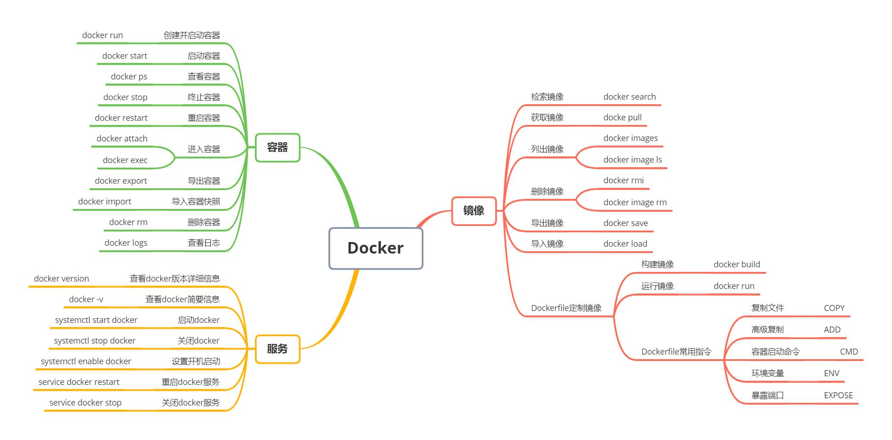

- 快速对系统进行清理，删除停止的容器，不用的image，等等
docker system prune -a -f

- 开启一个gin项目容器，映射端口，停止后自动删除容器
docker container run --rm -p 8080:8080 gin-demo

- 开启一个gin项目容器，映射端口，后台执行
docker container run -d -p 8080:8080 gin-demo

- 进去一个容器，开启交互shell
docker container exec -it [容器ID]

# 容器
启动：启动容器有两种方式，一种是基于镜像新建一个容器并启动，另外一个是将在终止状态（stopped）的容器重新启动。
- 新建并启动
docker run [镜像名/镜像ID]

指定端口，在后端运行
docker container run -p 80:80 nginx

- 启动已终止容器
docker start [容器ID]

- 列出本机运行的容器
docker ps 
- 列出本机所有的容器（包括停止和运行）
docker ps -a

停止容器
- 停止运行的容器
docker stop [容器ID]
- 杀死容器进程
docker  kill [容器ID] 

- 重启容器
docker restart [容器ID] 

- 删除容器
docker  rm [容器ID]

- 删除所有容器
docker rm $(docker ps -aq)

进入容器
- 如果从这个 stdin 中 exit，会导致容器的停止
docker attach [容器ID]
- 交互式进入容器
docker exec [容器ID]

进入容器通常使用第二种方式，docker exec后面跟的常见参数如下：

－ d, --detach 在容器中后台执行命令；
－ i, --interactive=true I false ：打开标准输入接受用户输入命令

导出和导入
- 导出容器
导出一个已经创建的容器到一个文件
docker export [容器ID]

- 导入容器
导出的容器快照文件可以再导入为镜像
docker import [路径]

- 查看日志

导出的容器快照文件可以再导入为镜像
docker logs [容器ID]

 -f : 跟踪日志输出
--since :显示某个开始时间的所有日志

-t : 显示时间戳

--tail :仅列出最新N条容器日志

 复制文件

- 从主机复制到容器
sudo docker cp host_path containerID:container_path 
- 从容器复制到主机
sudo docker cp containerID:container_path host_path

# 镜像

- 检索镜像
docker search 关键字

- 拉取镜像
docker pull [选项] [Docker Registry 地址[:端口号]/]仓库名[:标签]

- 列出镜像
docker image ls
docker images

- 删除镜像
docker rmi <镜像Id>

- 删除所有镜像
docker rmi $(docker images -q)

- 导出镜像
将镜像保存为归档文件
docker save

- 导入镜像
docker load

# Dockerfile构建镜像
下面是Dockerfile中一些常见的指令：

FROM：指定基础镜像
 
RUN：执行命令
 
COPY：复制文件
 
ADD：更高级的复制文件
 
CMD：容器启动命令
 
ENV：设置环境变量
 
EXPOSE：暴露端口
 
ENTRYPOINT: ENTRYPOINT于CMD非常类似，但是docker run执行的命令不会覆盖ENTRYPOINT
 
ARG :用于指定传递给构建运行时的变量
 
VOLUME : 用于指定持久化目录
 
WORKDIR : 工作目录，类似于cd命令
 
USER: 指定运行容器时的用户名或者UID，后续的一系列命令都将使用该用户

ONBUILD:用于设置镜像触发器
 
LABEL : 用于为镜像添加元数据

镜像构建:
docker build

镜像运行
docker run [镜像ID]

# 服务

- 查看Docker版本信息
docker version

- 查看docker简要信息
docker -v

- 启动Docker
systemctl start docker

- 关闭docker
systemctl stop docker

- 设置开机启动
systemctl enable docker

- 重启docker服务
service docker restart

- 关闭docker服务
service docker stop
